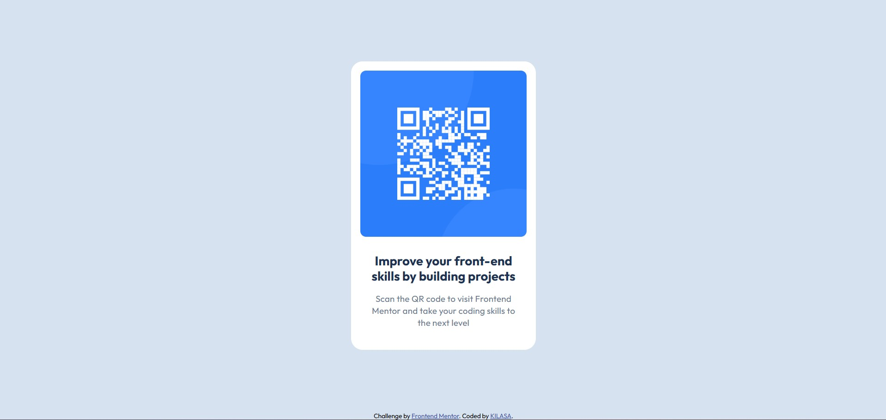

# Frontend Mentor - QR code component solution

This is a solution to the [QR code component challenge on Frontend Mentor](https://www.frontendmentor.io/challenges/qr-code-component-iux_sIO_H). Frontend Mentor challenges help you improve your coding skills by building realistic projects.

## Table of contents

- [Overview](#overview)
  - [Screenshot](#screenshot)
  - [Links](#links)
- [My process](#my-process)
  - [Built with](#built-with)
- [Author](#author)

## Overview

Purpose:

This QR code links to a resource on Frontend Mentor, a platform where you can build front-end projects to improve your skills.

How to use:

Scan the QR code using a QR code reader app on your phone or device.
This will take you to the Frontend Mentor website.
Choose a project that interests you and start building!
Benefits:

Learn by doing: Building projects is the best way to solidify your front-end knowledge.
Real-world experience: Frontend Mentor projects are based on real-world designs and challenges.
Community: Connect with other developers and get feedback on your work.
Additional notes:

If you don't have a QR code reader, you can manually enter the URL linked to by the code.
Frontend Mentor offers a variety of projects for different skill levels.
Feel free to customize this overview to better fit your project and the specific resource you're linking to.

### Screenshot

### Links

- Solution URL: [Add solution URL here](https://your-solution-url.com)
- Live Site URL: [Add live site URL here](https://kilasa-qr-code.netlify.app/)

## My process

### Built with

- Semantic HTML5 markup
- CSS custom properties
- Flexbox
- CSS Grid
- Mobile-first workflow

## Author

- GitHub - [@gkilasonia](https://github.com/gkilasonia?tab=repositories)
